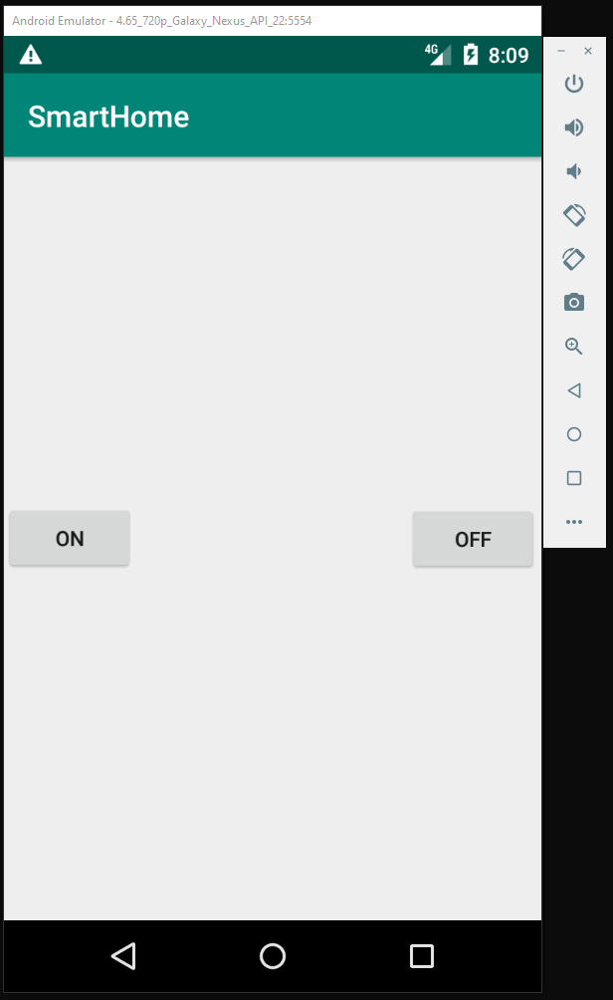

# SmartHome
This repositor contains complete software package for building remote (via andorid app) light switch (via arduino esp 8226 s0-1 module) 
Electrical scheme and the PCB gerber files can be found in the link below: 
LINK 
SolidWoks files for the 3D case can be found in the link below: 
LINK 

## Images
### System

### Circuit

### Android App

